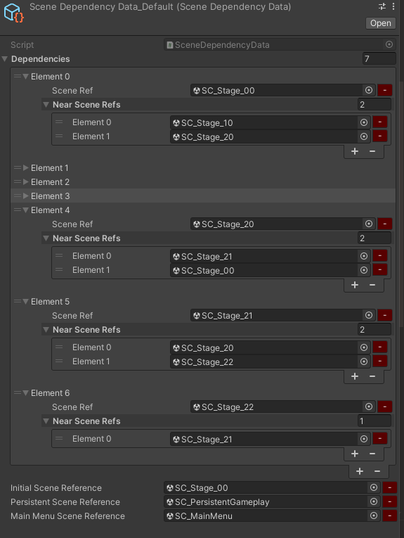

# [Munchkin](https://github.com/nachiketa3299/Munchkin) 프로젝트

## 기여한 부분

- 기획, 프로그래밍, 약간의 모델링

## 기획서

- [전체 콘셉트](https://substantial-panther-211.notion.site/9a3725e57d7b41a5891e7c0fe1c0d3d5?pvs=4)
- [기획 용어 정리](https://substantial-panther-211.notion.site/a19b8ac4a4904419a9b0a693b6b12ae4?pvs=4)
- [게임의 생애주기](https://substantial-panther-211.notion.site/61fe3ea8d1bb4b14b68105bb148ddb04?pvs=4)
- [게임플레이 서사](https://substantial-panther-211.notion.site/edf4c88bdcd14b2aa3114abfacb01176?pvs=4)
- [플레이어 입력](https://substantial-panther-211.notion.site/853508194aae4672a58a6a2715d4f414?pvs=4)
- [캐릭터 기획](https://substantial-panther-211.notion.site/243480d1e8b44ada8704811f08be5de6?pvs=4)
- [장치와 함정 기획](https://substantial-panther-211.notion.site/3dd5857436dc4a5abdaf021cf439e263?pvs=4)
- [레벨과 스테이지 기획](https://substantial-panther-211.notion.site/5553f23380f448b7a10b1157e1f28512?pvs=4)

## Major Implementation

### Dynamic & Additive Scene Loading & Tilemap System

[SceneReference.cs](https://github.com/nachiketa3299/Munchkin/blob/master/Assets/Scripts/Utility/SceneReference.cs)와 [SceneReferencePropertyDrawer](https://github.com/nachiketa3299/Munchkin/blob/master/Assets/Scripts/Utility/SceneReferencePropertyDrawer.cs)는 외부 애셋입니다. ([출처](https://github.com/NibbleByte/UnitySceneReference/blob/master/Assets/DevLocker/Utils/SceneReference.cs))

- [SceneDependencyData..cs](https://github.com/nachiketa3299/Munchkin/blob/master/Assets/Scripts/Cores/Data/SceneDependencyData.cs)
- [SceneDependencyData.Graph.cs](https://github.com/nachiketa3299/Munchkin/blob/master/Assets/Scripts/Cores/Data/SceneDependencyData.Graph.cs)

위 Scriptable Object를 통해 에디터에서 씬을 드래그 앤 드롭하여 아래처럼 씬들의 인접 관계를 선언할 수 있습니다.

SC_PersistentGameplay 씬은 게임 플레이 내내 언로드되지 않는 씬입니다. 이 씬에는 카메라, 각종 매니저 클래스, 그리고 동적으로 씬을 로드하는 주체 오브젝트들이 존재합니다.

동적으로 씬을 로드하는 주체 오브젝트는 모두 [SceneLoadTrigger.cs](https://github.com/nachiketa3299/Munchkin/blob/master/Assets/Scripts/Cores/SceneLoading/SceneLoadTrigger.cs) 컴포넌트가 부착되어야 합니다.

해당 컴포넌트가 씬의 경계를 나타내는 콜라이더에 입장(`OnTriggerEnter`)한 경우, 이를 SC_PersistentGameplay에 존재하는 [SceneLoadManager.cs](https://github.com/nachiketa3299/Munchkin/blob/master/Assets/Scripts/Cores/SceneLoading/SceneLoadManager.cs)가 취합하여, 로드하고 언로드할 씬을 판단합니다.

씬의 로딩은 비동기적으로 이루어지기 때문에, 씬 로드/언로드 요청이 `OnTriggerEnter`라는 물리 연산으로 호출되기 때문에 한 프레임 내에 중복되는 요청이 몰릴 수 있었습니다. 때문에 다양한 오브젝트로부터의 씬 로드/언로드 요청을 받아서 프레임의 끝에서 취합한 후, 실제 로드/언로드 연산을 수행하였습니다. 또한 로드/언로드 작업이 모두 비동기로 이루어졌기 때문에 로드 중, 언로드 중일때 요청이 들어오는 경우를 처리하기 위해 로딩 중/언로딩 중인 씬들을 나타내는 컨테이너를 따로 관리하였습니다.

캐릭터가 죽은 경우, 영혼 상태에서 부활 지점(알)을 탐색해야 해서, 알이 존재하는 씬은 언로드하지 않습니다. 

궁극적으로 모든 씬(스테이지)는 타일 맵 시스템으로 구축될 것입니다. 아주 많은 작은 게임오브젝트에 대해서 로드와 언로드가 매끄럽게 진행되길 원했는데, 에디터에서는 씬 로드/언로드가 일어날 때마다 약간의 프레임 드랍이 있었지만, 빌드 버전에서는 매끄럽게 진행되었습니다.

### Egg Object Lifecycle with Object Pool & Observer Pattern

플레이어블 캐릭터는 월드에 알이라는 특수한 오브젝트를 배치할 수 있습니다.
모든 알은 오브젝트 풀에 의해 관리됩니다.

오브젝트 풀 관련 스크립트는 아래와 같습니다.

- [PoolBase.cs](https://github.com/nachiketa3299/Munchkin/blob/master/Assets/Scripts/Cores/Egg/PoolBase.cs) : 모든 풀의 기초 클래스
- [EggPool.cs](https://github.com/nachiketa3299/Munchkin/blob/master/Assets/Scripts/Cores/Egg/EggPool.cs) : 달걀 오브젝트를 관리하는 풀
- [BrokenEggPool.cs](https://github.com/nachiketa3299/Munchkin/blob/master/Assets/Scripts/Cores/Egg/BrokenEggPool.cs) : 깨진 달걀을 관리하는 풀

알은 고유의 생애주기를 가집니다. 다음은 알과 깨진 알의 생애주기를 관리하는 핵심 스크립트입니다.

- [EggLifecycleHandler.cs](https://github.com/nachiketa3299/Munchkin/blob/master/Assets/Scripts/Cores/Egg/EggLifeCycleHandler.cs)
- [BrokenEggLifecycleHandler.cs](https://github.com/nachiketa3299/Munchkin/blob/master/Assets/Scripts/Cores/Egg/BrokenEggLifecycleHandler.cs)

알이 생애주기를 종료하는 경우, 마지막 위치에 깨진 알을 생성할 지 여부를 제어할 수 있습니다.

알의 생애주기를 시작하는 요인은 두 가지가 있습니다. 둥지에서 알이 생성되는 경우가 있고([NestEggHandler.cs](https://github.com/nachiketa3299/Munchkin/blob/master/Assets/Scripts/Cores/Nest/NestEggHandler.cs)) , 캐릭터에 의해 배치([EggAction.cs](https://github.com/nachiketa3299/Munchkin/blob/master/Assets/Scripts/Cores/Actions/EggAction.cs))되는 경우가 있습니다. 두 스크립트는 모두 싱글턴 오브젝트에 부착된 EggPool 컴포넌트에게 Egg를 가져와 달라고 요청합니다.

알이 생애주기를 종료하는 요인은 현재 알의 체력([EggHealthManager.cs](https://github.com/nachiketa3299/Munchkin/blob/master/Assets/Scripts/Cores/Egg/EggHealthManager.cs))입니다. 체력이 0 이하로 떨어지면, 생애주기를 명시적으로 종료합니다. 체력이 변경되면, 체력이 변경되었음을 알리기 때문에, 이를 구독하는 다른 컴포넌트들이 활용할 수 있습니다. 현재 알의 체력이 변경되면, 동적으로 머터리얼을 변경하여 알이 마치 깨져가는 것 처럼 보이게 하는 효과를 주었습니다.

### Character System
