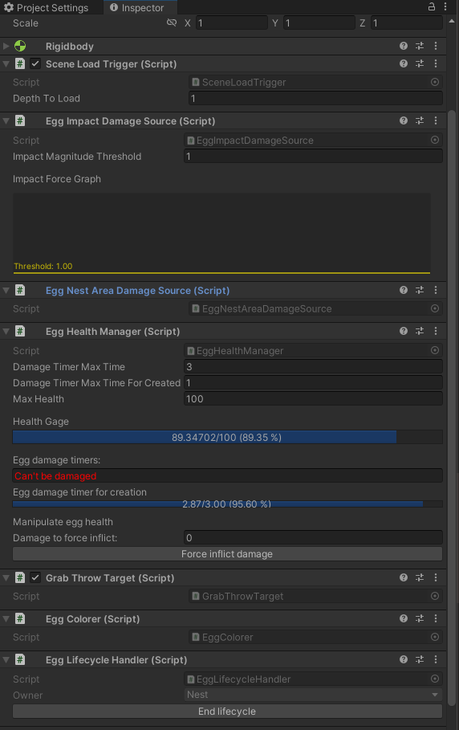

# [Munchkin](https://github.com/nachiketa3299/Munchkin) 프로젝트

## 기여한 부분

- 기획
- 프로그래밍
- (약간의) 모델링

## 기획서

- [전체 콘셉트](https://substantial-panther-211.notion.site/9a3725e57d7b41a5891e7c0fe1c0d3d5?pvs=4)
- [기획 용어 정리](https://substantial-panther-211.notion.site/a19b8ac4a4904419a9b0a693b6b12ae4?pvs=4)
- [게임의 생애주기](https://substantial-panther-211.notion.site/61fe3ea8d1bb4b14b68105bb148ddb04?pvs=4)
- [게임플레이 서사](https://substantial-panther-211.notion.site/edf4c88bdcd14b2aa3114abfacb01176?pvs=4)
- [플레이어 입력](https://substantial-panther-211.notion.site/853508194aae4672a58a6a2715d4f414?pvs=4)
- [캐릭터 기획](https://substantial-panther-211.notion.site/243480d1e8b44ada8704811f08be5de6?pvs=4)
- [장치와 함정 기획](https://substantial-panther-211.notion.site/3dd5857436dc4a5abdaf021cf439e263?pvs=4)
- [레벨과 스테이지 기획](https://substantial-panther-211.notion.site/5553f23380f448b7a10b1157e1f28512?pvs=4)

## Major Implementation

### Dynamic & Additive Scene Loading & Tilemap System

[SceneReference.cs](https://github.com/nachiketa3299/Munchkin/blob/master/Assets/Scripts/Utility/SceneReference.cs)와 [SceneReferencePropertyDrawer](https://github.com/nachiketa3299/Munchkin/blob/master/Assets/Scripts/Utility/SceneReferencePropertyDrawer.cs)는 외부 애셋입니다. ([출처](https://github.com/NibbleByte/UnitySceneReference/blob/master/Assets/DevLocker/Utils/SceneReference.cs))

- [SceneDependencyData..cs](https://github.com/nachiketa3299/Munchkin/blob/master/Assets/Scripts/Cores/Data/SceneDependencyData.cs)
- [SceneDependencyData.Graph.cs](https://github.com/nachiketa3299/Munchkin/blob/master/Assets/Scripts/Cores/Data/SceneDependencyData.Graph.cs)

위 Scriptable Object를 통해 에디터에서 씬을 드래그 앤 드롭하여 아래처럼 씬들의 인접 관계를 선언할 수 있습니다.

SC_PersistentGameplay 씬은 게임 플레이 내내 언로드되지 않는 씬입니다. 이 씬에는 카메라, 각종 매니저 클래스, 그리고 동적으로 씬을 로드하는 주체 오브젝트들이 존재합니다.

동적으로 씬을 로드하는 주체 오브젝트는 모두 [SceneLoadTrigger.cs](https://github.com/nachiketa3299/Munchkin/blob/master/Assets/Scripts/Cores/SceneLoading/SceneLoadTrigger.cs) 컴포넌트가 부착되어야 합니다.

해당 컴포넌트가 씬의 경계를 나타내는 콜라이더에 입장(`OnTriggerEnter`)한 경우, 이를 SC_PersistentGameplay에 존재하는 [SceneLoadManager.cs](https://github.com/nachiketa3299/Munchkin/blob/master/Assets/Scripts/Cores/SceneLoading/SceneLoadManager.cs)가 취합하여, 로드하고 언로드할 씬을 판단합니다.

씬의 로딩은 비동기적으로 이루어지기 때문에, 씬 로드/언로드 요청이 `OnTriggerEnter`라는 물리 연산으로 호출되기 때문에 한 프레임 내에 중복되는 요청이 몰릴 수 있었습니다. 때문에 다양한 오브젝트로부터의 씬 로드/언로드 요청을 받아서 프레임의 끝에서 취합한 후, 실제 로드/언로드 연산을 수행하였습니다. 또한 로드/언로드 작업이 모두 비동기로 이루어졌기 때문에 로드 중, 언로드 중일때 요청이 들어오는 경우를 처리하기 위해 로딩 중/언로딩 중인 씬들을 나타내는 컨테이너를 따로 관리하였습니다.

캐릭터가 죽은 경우, 영혼 상태에서 부활 지점(알)을 탐색해야 해서, 알이 존재하는 씬은 언로드하지 않습니다. 

궁극적으로 모든 씬(스테이지)는 타일 맵 시스템으로 구축될 것입니다. 아주 많은 작은 게임오브젝트에 대해서 로드와 언로드가 매끄럽게 진행되길 원했는데, 에디터에서는 씬 로드/언로드가 일어날 때마다 약간의 프레임 드랍이 있었지만, 빌드 버전에서는 매끄럽게 진행되었습니다.

어떤 오브젝트에 의해 어떤 씬의 로드가 유지되고 있는지 에디터에서 쉽게 확인하기 위해, 에디터 스크립트를 작성하기도 하였습니다.

오브젝트별 로드된 씬 이름의 목록은 SceneLoadManager 클래스 내에서는 딕셔너리로 관리되고 있었는데, 에디터 스크립트 [SceneLoadManagerEditor.cs](https://github.com/nachiketa3299/Munchkin/blob/master/Assets/Scripts/Editor/SceneLoadManagerEditor.cs)에서 이를 가져오는 것이 주요 난관이었습니다. 

딕셔너리는 기본적으로 유니티에서 직렬화를 제공하지 않고, 오직 이 에디터 편의기능만을 위해 딕셔너리를 직렬화하는 스크립트를 짜는 것은 비효율적이었습니다. 따라서 C#에서 제공하는 리플렉션 기능을 통해 SceneLoadManager의 private 딕셔너리 필드에 접근하여 정보를 읽어오도록 구현하였습니다.

### Egg Object Lifecycle with Object Pool & Observer Pattern

플레이어블 캐릭터는 월드에 알이라는 특수한 오브젝트를 배치할 수 있습니다.
모든 알은 오브젝트 풀에 의해 관리됩니다.

오브젝트 풀 관련 스크립트는 아래와 같습니다.

- [PoolBase.cs](https://github.com/nachiketa3299/Munchkin/blob/master/Assets/Scripts/Cores/Egg/PoolBase.cs) : 모든 풀의 기초 클래스
- [EggPool.cs](https://github.com/nachiketa3299/Munchkin/blob/master/Assets/Scripts/Cores/Egg/EggPool.cs) : 달걀 오브젝트를 관리하는 풀
- [BrokenEggPool.cs](https://github.com/nachiketa3299/Munchkin/blob/master/Assets/Scripts/Cores/Egg/BrokenEggPool.cs) : 깨진 달걀을 관리하는 풀

알은 고유의 생애주기를 가집니다. 다음은 알과 깨진 알의 생애주기를 관리하는 핵심 스크립트입니다.

- [EggLifecycleHandler.cs](https://github.com/nachiketa3299/Munchkin/blob/master/Assets/Scripts/Cores/Egg/EggLifeCycleHandler.cs)
- [BrokenEggLifecycleHandler.cs](https://github.com/nachiketa3299/Munchkin/blob/master/Assets/Scripts/Cores/Egg/BrokenEggLifecycleHandler.cs)

알이 생애주기를 종료하는 경우, 마지막 위치에 깨진 알을 생성할 지 여부를 제어할 수 있습니다.

알의 생애주기를 시작하는 요인은 두 가지가 있습니다. 둥지에서 알이 생성되는 경우가 있고([NestEggHandler.cs](https://github.com/nachiketa3299/Munchkin/blob/master/Assets/Scripts/Cores/Nest/NestEggHandler.cs)) , 캐릭터에 의해 배치([EggAction.cs](https://github.com/nachiketa3299/Munchkin/blob/master/Assets/Scripts/Cores/Actions/EggAction.cs))되는 경우가 있습니다. 두 스크립트는 모두 싱글턴 오브젝트에 부착된 EggPool 컴포넌트에게 Egg를 가져와 달라고 요청합니다.

알이 생애주기를 종료하는 요인은 현재 알의 체력([EggHealthManager.cs](https://github.com/nachiketa3299/Munchkin/blob/master/Assets/Scripts/Cores/Egg/EggHealthManager.cs))입니다. 체력이 0 이하로 떨어지면, 생애주기를 명시적으로 종료합니다. 체력이 변경되면, 체력이 변경되었음을 알리기 때문에, 이를 구독하는 다른 컴포넌트들이 활용할 수 있습니다. 현재 알의 체력이 변경되면, 동적으로 머터리얼을 변경하여 알이 마치 깨져가는 것 처럼 보이게 하는 효과를 주었습니다. 아주 간단한 셰이더 그래프를 제작하여 구현하였습니다.

(참고) 사실 알과 깨진 알은 게임 월드에 많아야 두 개가 배치될 계획이었으므로, 사실 오브젝트 풀링이 필요하지 않았습니다. 유니티 엔진에 기본으로 구비된 풀링을 사용해 보고 싶어서 내린 결정이었지만, 이것들이 모든 것을 어렵게 만들었습니다. 알과 깨진 알이 활성화 될때 어떤 속성들이 명시적으로 초기화 되어야 하는지, 그리고 비활성화 될 때 어떤 속성들이 명시적으로 정리되어야 하는지 결정하고 적용하는 것이 상당히 어려웠습니다.

알의 생애주기를 종료하는 요인은 알의 체력이었고, 알의 체력에 영향을 주는 요인은 데미지원 이라고 정의하였습니다. 

- [EggDamageSourceBase.cs](https://github.com/nachiketa3299/Munchkin/blob/master/Assets/Scripts/Cores/Egg/DamageSources/EggDamageSourceBase.cs)
- [EggImpactDamageSource.cs](https://github.com/nachiketa3299/Munchkin/blob/master/Assets/Scripts/Cores/Egg/DamageSources/EggImpactDamageSource.cs)
- [EggNestAreaDamageSource.cs](https://github.com/nachiketa3299/Munchkin/blob/master/Assets/Scripts/Cores/Egg/DamageSources/EggNestAreaDamageSource.cs)

EggDamageSourceBase의 파생 클래스들이 구체적인 데미지 원입니다. 데미지 사건의 발생 여부와 체력의 감소 여부를 세세하게 컨트롤 할 수 있게 만드는 것이 목표였습니다.

또한, 에디터에서 알의 생애주기를 명시적으로 관리할 수 있도록, 위처럼 개발에 도움을 주는 에디터 도구들을 작성하기도 하였습니다.

(참고) 둥지 알을 생성하는 둥지의 구조

알 오브젝트는 완전한 구형이 아니기 때문에 물리 효과를 정확하게 표현하기 위해서 컴파운드 콜라이더를 사용하였습니다. 문제는 둥지에서 생성된 알이 둥지 밖으로 이탈하는 경우 파괴시키는 로직이 필요했는데, 둥지 전체를 하나의 영역으로 감싸는 경우 컴파운드 콜라이더가 `OnTriggerExit` 이벤트를 여러번 호출할 가능성이 항상 존재했습니다.

이걸 해결하는 것이 상당히 어려웠지만, 위처럼 둥지의 구조를 단일 트리거 콜라이더가 아니라, 4개의 박스 콜라이더가 주변을 감싸도록 만들었습니다. 개발을 편하게 하기 위해, [NestVolumeGenerator.cs](https://github.com/nachiketa3299/Munchkin/blob/master/Assets/Scripts/Cores/Nest/NestVolumeGenerator.cs)로 둥지의 영역을 쉽게 설정하고, 에디터에서 확인할 수 있도록 만들었습니다.
게임이 시작되면, NestVolumeGenerator의 값을 토대로 트리거 콜라이더가 생성됩니다.

또한 달걀이 둥지의 어디에서 소환되고, 충돌 박스가 어느정도인지 표현할 필요가 있었습니다. 이를 표현하기 위해 알 이라는 오브젝트의 Bound 정보가 필요했는데, 알은 복합 콜라이더이므로 손수 계산할 필요가 있었습니다. 에디터에서도 알의 전체 바운드 정보를 시각화 하고 싶었는데, 문제는 인스턴스화 되지 않은 게임 오브젝트(프리팹)의 복합 콜라이더의 바운드를 계산할 수가 없었다는 점입니다. 

이를 해결하기 위해 에디터 스크립트 [EggPhysicalDataEditor.cs](https://github.com/nachiketa3299/Munchkin/blob/master/Assets/Scripts/Editor/EggPhysicalDataEditor.cs)를 작성하였습니다. 

아래처럼 인스턴스화 되지 않은 EggPrefab의 렌더러를 통해 바운드를 직접 계산한 후, 그 정보를 에디터 시점에 저장해 둡니다. 그리고 이를 게임 플레이 시점에서 사용할 수 있도록 만들었습니다.

### Character System

#### Lifespan Handling

캐릭터의 경우 실제 시간에 따라 자연스럽게 노화하고, 수명의 각 시점에서 다른 캐릭터로 변이해야 하였습니다.

때문에 캐릭터의 로직만 관리하는 루트 게임오브젝트 P_CharacterObject를 만들고, 해당 오브젝트의 하위 오브젝트에서 필요한 비주얼 프리팹을 인스턴싱 하는 방법으로 구현하였습니다.

캐릭터의 실제 비주얼 프리팹들은 원형 프리팹의 바리언트로 관리하였습니다.

어떤 비주얼 프리팹을 인스턴싱 할 지는 스크립터블 오브젝트를 이용해 관리하였습니다. 이를 이용해 아티스트가 모델을 업데이트 하는 경우 스크립터블 오브젝트만 다시 정의하여 갈아 끼우는 방식으로 게임 로직과 데이터를 분리하려는 의도입니다.

(참고) 현재 일괄적으로 모든 애니메이션이 적용되지 않았는데, 아직 애니메이션이 제작되지 않았기 때문에 그렇습니다.

캐릭터 수명을 전체적으로 통제하는 스크립트는 [LifespanHandler.cs](https://github.com/nachiketa3299/Munchkin/blob/master/Assets/Scripts/Cores/Character/LifespanHandler.cs)입니다. 마찬가지로 옵저버 패턴의 주체로서 구현되었으며, 수명의 시작, 변화, 끝이 발생하였음을 구독자들에게 알립니다.

알 오브젝트와 마찬가지로 캐릭터 수명의 각 시점에서 일어나는 사건들을 에디터에서 통제해야 할 일이 많았으므로, 전용 에디터 스크립트를 통해 쉽게 수명을 조절할 수 있도록 만들었습니다.

#### Input & Action

캐릭터 오브젝트의 주요 로직은 단연 입력 처리와 입력에 바인드된 액션들입니다.

입력은 모두 유니티의 새 입력 시스템인 InputSystem을 사용하였습니다. InputActionAsset을 통해 생성된 C# 클래스 IA_InputActions.cs와 [InputHandler.cs](https://github.com/nachiketa3299/Munchkin/blob/master/Assets/Scripts/Cores/Character/InputHandler.cs)를 통해 입력과 그 바인딩을 관리하였습니다.

위는 캐릭터가 각 Action을 수행하는 영상입니다.

Nest에서 생성된 Egg를 캐릭터가 들고 Nest 밖으로 빠져나가려고 할 때 Nest Egg를 파괴하고, [GrabThrowAction.cs](https://github.com/nachiketa3299/Munchkin/blob/master/Assets/Scripts/Cores/Actions/GrabThrowAction.cs)을 초기화하는 것이 어려웠습니다.

마찬가지로 잦은 수정이 필요한 경우 에디터에서 쉽게 테스트 할 수 있도록 각 액션별 에디터 스크립트 또한 작성하였습니다. (현재 지속 입력을 통해 발동되는 Action도 있으나, 애니메이션이 존재하지 않아 확인이 어려웠습니다. 이를 게이지로 표시하여 한 눈에 알아볼 수 있도록 만들었습니다.)

#### Handlers

[RotationHandler.cs](https://github.com/nachiketa3299/Munchkin/blob/master/Assets/Scripts/Cores/Character/RotationHandler.cs)는 캐릭터의 좌 우 회전을 담당하는데, 부드럽게 회전(Lerp)하도록 만드는 버전과, 단순히 Flip하는 버전을 동시에 만들었습니다. Lerp 시키는 경우 항상 캐릭터가 화면의 전방을 바라보면서 회전시키고 싶었는데, 이를 구현하는 것이 약간 어려웠습니다.

[VisualInstanceHandler.cs](https://github.com/nachiketa3299/Munchkin/blob/master/Assets/Scripts/Cores/Character/VisualInstanceHandler.cs)는 현재 가장 완성도가 떨어지는 클래스입니다. Lifespan에 따라서 스크립터블 오브젝트에 선언된 캐릭터의 비주얼 인스턴스들을 활성화 하고 비활성화 하는 역할만 수행하고 있습니다.

[SoulMovementHandler.cs](https://github.com/nachiketa3299/Munchkin/blob/master/Assets/Scripts/Editor/SoulMovementHandlerEditor.cs)또한 구현이 어려웠습니다. 캐릭터가 죽은 경우, 플레이어에게 제어권을 뺏고, 영혼 상태가 되어 다음과 같은 로직으로 최적의 부활 지점으로 이동합니다.

1. 캐릭터 알이 월드에 배치되어 있다면, 가장 가까운 캐릭터 알로 이동한다.
2. 캐릭터 알이 월드에 배치되어 있지 않다면, 가장 가까운 둥지 알로 이동한다.

둥지 알이 존재하지 않는 경우의 Fallback 처리를 현재 진행하고 있는데, 아직까지는 둥지 알이 존재하지 않는 경우가 발생하지 않았습니다.

#### TODO: Character FSM

현재 캐릭터의 행동들은 항상 실행 가능합니다. 하지만 기획에는, 특정 형태에서만 가능한 것도 있고 특정 맥락에서는 어떤 행동은 불가능한 경우도 있습니다. 하지만 아직 이러한 처리가 구현되어 있지 않고, 이는 의도된 사항입니다.

이를 일관되게 처리하기 위해서 캐릭터의 유한 상태 머신을 구현하는 것이 목표이고, 이는 중대한 구현 사항이기에 아직 진행하고 있지 않습니다.